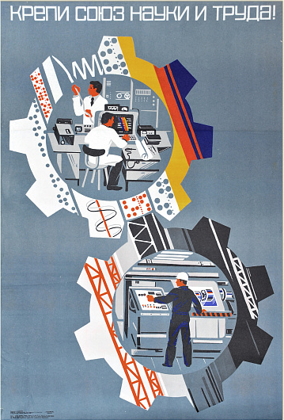

# MFormula 

## Необычный "калькулятор"

Скриптовый язык для решения математических и других задач. Написан на C/C++ с использованием стандартной библиотеки.
Изначально он был создан как парсер математических выражений, позже были добавлены "if", "array" и другие "радости жизни".
По мере необходимости будут вноситься дополнительные изменения. В идеале обзавестись программой для расчета систем автоматического управления.

## Текущие возможности
__объявление переменных__ 

    var a = 1917;

__объявление списков__ 

    var list = { 1, 1, 1 };

__объявление функций__ 

    func def(var a, b){
        return (a+b)*10-(a+b);
    }

__if-else__ 

    if(a > b){
        print("a > b");
    }

__for__ 

    for(var i = 0; i != 3 ; i++ ){
        print(i);
    }

__while__ 

    while(true){
        // code
    }

__подключаемые файлы__ 

    // lib -> name of file with code
    include lib; 

## Пример кода

    ./examples/fibo.math

    var num1 = 0;   // first num 
    var num2 = 1;   // second num
    var temp;       // temp var
    var next;       // next num
    var n = 188;    // position

    if (n >= 1){
        print("1 --> 0");
    }
    if (n >= 2){
        print("2 --> 1");
    }
    for(var _count = 0; _count < n - 2; _count++ ){
        next = num1 + num2;
        temp = _count+3;
        print("%temp% --> %next%");
        num1 = num2;
        num2 = next;
    }
